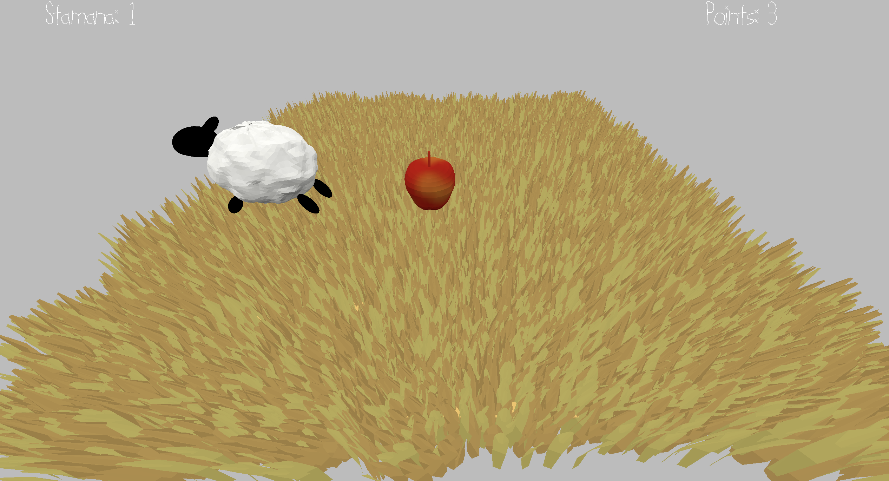

# Herd A Noise

Author: Flora Cheng

Design: It's a 3d jump to collect an item game, however we can't see our character! But it's a noisy sheep who we can hear, so navigate by ear to collect the floating apples.

Screen Shot:

How To Play:

<!-- (TODO: describe the controls and (if needed) goals/strategy.) -->
This lazy sheep is hidden in the fields, but their owner still wants to keep them well fed and fit! Thus they leave the sheep floating apples that the sheep has to jump to reach.

Use wasd to move the sheep, f to yell and space to jump! Because this sheep is lazy, it won't jump until it's stamana bar is above 10 but it's ready to yell at any time.

This game was built with [NEST](NEST.md).
